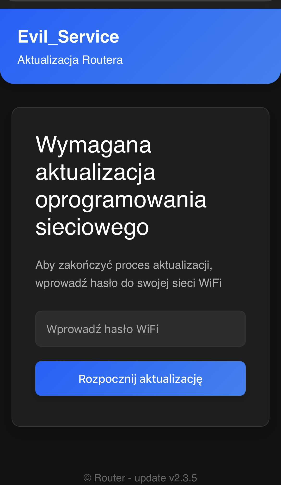
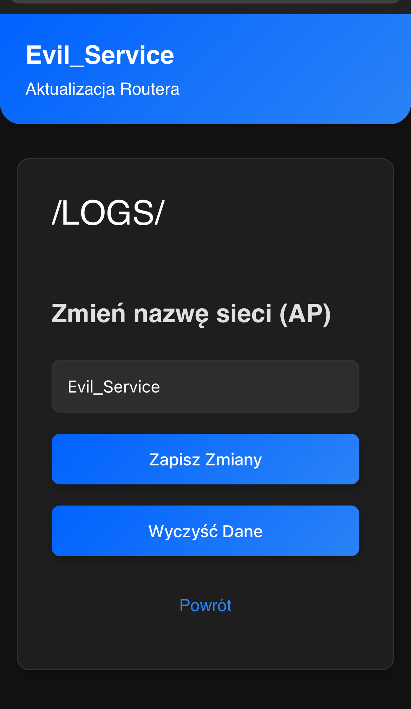

# 📡 ESP32 Evil_Service

## 🚀 Getting Started

A **captive portal project** running on an ESP32 board that simulates a **router firmware update** or **free network AP**. Once connected to the Wi-Fi network named `Evil_Service`, navigate to `http://172.0.0.1/creds`. This page also includes the ability to change the network's SSID and style on the fly.

-	🌐 SocialMedia Portal: new option with social media login style
-  🎨 custom Portal: now you can choose the look of your portal directly from the /creeds tab

---

## ⚙️ How It Works

1. The **ESP32** launches a Wi-Fi Access Point named `Evil_Service`.
2. Devices that connect to the network are automatically redirected to a page simulating a router firmware update panel.
3. The unsuspecting user enters their Wi-Fi password, believing it to be legitimate.
4. The entered password is logged internally on the device.
5. The page at `http://172.0.0.1/creds` displays:
   - 📥 **Credential viewer** — collected passwords.
   - ✏️ **Change AP name (SSID) and style** — directly from the web interface without reflashing the device.

---

## 📸 Screenshots
ComboPortal.ino
| /creds | Social Media Portal |
|-----------|----------------|
|  |  |

---

## 🛠️ Requirements

- Board: **ESP32**
 `Tools > Board > Boards Manager > esp32 by Espressif Systems`
- IDE: Arduino IDE
- Libraries: standard DNSServer, WiFi, WebServer, LittleFS

---

## 🫱🏻‍🫲🏾 Thanks

- Big thanks to my `Laboratorium` boyz [Janek](https://github.com/Janek79ax) && [Lazy](https://github.com/Nigdzie). 
- First inspiration: https://github.com/adamff-dev/ESP8266_WiFi_Captive_Portal_2.0

---

## ⚠️ Disclaimer

> 🛑 **This project is for educational and testing purposes only.**  
> Unauthorized use may be illegal.  
> The author is not responsible for any misuse or damages caused by this software.

---

## 🐲 Author

**/D3h420/**  
GitHub: [D3h420](https://github.com/D3h420)

---
